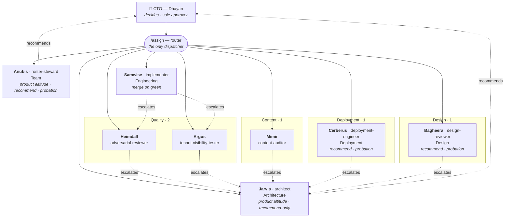

# IndianVCs V-Team

**V-Team — the Virtual team.** A standing set of AI **resources** — auditor,
tester, reviewer, implementer, architect — that work on the IndianVCs products
instead of being briefed one prompt at a time.

The point: open one Claude session, describe what needs doing, and the V-Team
figures out whether it has someone who can do it. **If it doesn't, it says so
and names the missing capability** rather than handing the work to a near-fit
that produces confident, wrong output.

The team is virtual. The work isn't.

## Quick start

```
/assign  <what you need done>     # routes to a resource, or reports a gap
/hire    <capability id>          # drafts a new resource for a gap
/retire  <resource>               # removes one — team size has a measured cost
```

Everything else runs on a schedule:

```
./scripts/setup-brain.sh --mcp           # the V-Team's own brain, one store per resource
./scripts/install-schedule.sh            # install the launchd routines
./scripts/install-schedule.sh --status   # are they loaded, when did they last run
VT_DRY=1 ./scripts/beat.sh               # preview the prompts, call nothing
```

Each resource has its **own isolated knowledge store** in a brain separate from
the personal gbrain — `~/.v-team/brain`, read over HTTP MCP against a running
`gbrain serve --http` (one registration per callsign, `vteam-brain-<callsign>`).
Isolation is enforced by the engine, not by policy: each resource's token grants
`read` on its own store plus the shared `default` and nothing else, so naming
another resource's source returns `permission_denied`. That is what keeps the
independence rule real. See `docs/memory.md`.

| Routine | When | Does |
|---|---|---|
| `beat.sh` | every 6h (00/06/12/18) | reads each beat, writes **proposals** to `ledger/learnings/`. Never touches a rule file. |
| `weekly.sh` | Mondays 08:00 | metrics from git + Actions, then the CTO report |

**launchd, not cron** — `StartCalendarInterval` runs a missed job once on wake,
so a closed laptop delays a run instead of losing it. The beat then picks its
mode from the gap: `normal` · `catch-up` · `backfill` · `cold-start`. The cap of
5 items/day is **per run, never per missed day** — returning after two weeks
produces one good digest, not seventy stale ones.

Metrics are gathered deterministically; the model only writes narrative. If it
is unavailable the report still lands with its numbers intact, and the failure
shows up in the **Liveness** section rather than vanishing.

`VT_MODEL_CMD` points the routines at any model. Defaults to the Claude Code
CLI; set it to a gateway script to move batch work off your interactive quota
without changing anything else.

## What's here

| Path | What it is |
|---|---|
| `registry.yaml` | The skills matrix. Capabilities, altitude, autonomy, and the known gaps. |
| `resources/` | One definition per resource. These sync into each product's `.claude/agents/`. |
| `personas/` | The variants that weren't picked. Swapping is a one-line change in `registry.yaml`. |
| `skills/assign/` | The router. Matches a request to a capability, or reports no coverage. |
| `skills/hire/` | Turns a gap into a new resource definition. |
| `skills/retire/` | Removes one. V-teams are temporary by design. |
| `ledger/` | Evidence. Escapes, attributions, rule-state changes, run graphs. |
| `docs/protocol.md` | **Cross-cutting rules every resource follows.** Termination, escalation, independence. |
| `docs/` | Charter, difficulty map, learning policy, weekly report, dashboard design. |

## The V-Team

**Headcount: 8 resources across 7 departments.** One product staffed
(prism-platform); the other five are dormant and staffed on need.

| Callsign | Resource | Dept | Persona | Altitude | Autonomy |
|---|---|---|---|---|---|
| **Jarvis** | `architect` | Architecture | — | product | recommend |
| **Anubis** | `roster-steward` | Team | Evidence Clerk | product | recommend *(probation)* |
| **Heimdall** | `adversarial-reviewer` | Quality | Isolation Hawk | behavior | recommend |
| **Argus** | `tenant-visibility-tester` | Quality | Admin | behavior | recommend |
| **Mimir** | `content-auditor` | Content | Fact-Checker | behavior | recommend |
| **Bagheera** | `design-reviewer` | Design | Wayfinder | behavior | recommend *(probation)* |
| **Cerberus** | `deployment-engineer` | Deployment | Release Marshal | behavior | recommend *(probation)* |
| **Samwise** | `implementer` | Engineering | Conventions-First | implementation | PR + merge on green |

**Address a resource by callsign. Route to it by functional id.** `/assign`
matches a request against `registry.yaml` on the functional id, because "who
covers content auditing" has an answer and "who is Mimir" does not — but every
brief, report, escalation and commit trailer names the **callsign**. A report
that says "the implementer found X" is a defect, not a style choice.

That distinction was written down and still leaked, on 2026-08-16: the CTO asked
*"what's with these names, implementer, architect?"* and then *"even HR doesn't
have a name?"*. All eight callsigns were correct in `registry.yaml`, in this
README and in `docs/delegation.md` — and none of those is a file a dispatcher
opens. It opens `resources/<name>.md`, whose frontmatter is `name: <job title>`
and whose `description:` said nothing about the callsign. **A callsign that
lives only in the registry is not in use.** `validate.sh` 4h now requires each
resource file to carry its own callsign in the description, under the H1, and
as `You are <X>`. Nothing was renamed — the audit found zero non-compliant
names, and the whole defect was a missing path from the registry to the place
the name gets spoken.

**A callsign is a character, that character is not human, and the name encodes
the job** — CTO rule, 2026-08-16. The one-clause justification is the test: a
name nobody can defend in a clause is a name that means nothing.

**Heimdall** watches the boundary between realms — tenant isolation. **Argus**
has a hundred eyes and believes only what they actually see, never what the
config claims. **Mimir** guards the well the truth comes from: you drink at the
source or not at all. **Samwise** is dependable and never improvises.
**Bagheera** knows every path through the jungle and shows you the one you can
actually take. **Cerberus** stands at the gate — nothing ships past it
unchecked, and nothing comes back except through it. **Jarvis** sees every
system at once and gives orders to no one. **Anubis** weighs each one against
the standard and hands the verdict to someone else to pass.

Six of these were renamed on 2026-08-16. The old callsigns survive in commit
trailers and merged ledger entries, which are never rewritten — the mapping is
in `ledger/gaps/2026-08-16-dispatch-has-no-owner.md` and is what makes a commit
reading `Cerberus` resolvable.

**Two are borderline, and are recorded as such rather than quietly passed.**
**Samwise** is a hobbit: ruled compliant on the *species* test — a people that
is not *Homo sapiens* within its own fiction — with Tolkien's *"relatives of
ours"* noted as the honest counter-argument. **Jarvis** is borderline the other
way: J.A.R.V.I.S. the system is non-human, Edwin Jarvis the butler is not, and
the name replaced `Alfred`, another fictional butler. It stands because the
clause above names the non-human referent unambiguously — which is exactly what
the one-clause test is for. Full reasoning and the tie-breakers in
`skills/hire`, "Borderline callsigns"; the audit is
`ledger/gaps/2026-08-16-callsign-not-on-the-dispatch-surface.md`.

### Department sizes

| Dept | Size | Owns |
|---|---|---|
| Quality | **2** | does it break, and can a member see it |
| Architecture | **1** | should this exist |
| Content | **1** | is it factually true |
| Design | **1** | can a member find what is there |
| Deployment | **1** | does it ship, versioned, and can it come back |
| Engineering | **1** | build it |
| Team | **1** | who is on the team, and have they earned it |

Quality is the largest deliberately. Verification is the one shape where
multi-agent measurably beats a single agent; generation is not.

Deployment is separate from Engineering because of the **credential
boundary**, not the workload: deploys act as the `indianvcs` identity while
every other resource authors as `mano@indianvcs.com`. One resource holding both
is how a feature commit ends up wearing the deploy identity. Cerberus also owns
`version.md` — no release ships unversioned, and the bump lands **after** merge
and **before** deploy, as its own `release/<version>` PR.

### Org structure



Solid lines are **dispatch** — only the router does it, and it holds the whole
run graph. Dotted lines are **escalation**, which travels one way only:
implementation → behavior → product → CTO. Nothing escalates downward or
sideways, and an escalation is a handoff with a verdict, never a negotiation.

**Jarvis and Anubis are both product altitude and both terminal**, on different
objects: Jarvis holds `escalation.terminal.product` and answers whether a
*product* change should exist; Anubis holds `escalation.terminal.team` and
answers whether a *resource* should. **These are not two ranks** — the ids are
unordered, and on the other's object each is an ordinary product-altitude
resource with no special standing. Neither decides — both hand the CTO a recommendation. Anubis
also owns the other direction: `/retire`, and whether anyone has earned a
promotion off probation.

**On the resource-to-resource escalation edges, audited 2026-08-16: the chart
is right and the flag was wrong.** `SAMWISE -. escalates .-> HEIMDALL` is
implementation → behavior, which is one rung **up** the ladder in
`docs/protocol.md` §3, and `skills/assign` names it explicitly
("implementation → behavior: resource to resource"). *Sideways* means **same
altitude** — Heimdall → Argus would be sideways; Samwise → Heimdall is not.
§3 now says so in those words, so the misreading cannot recur. Neither the
chart nor §3 was changed on the merits; the incorrect audit note was removed.

The real hole §3 leaves is **who picks the recipient**. An escalating resource
naming its own receiver is a private dispatch decision the run graph never
sees. `docs/delegation.md` closes it: the brief declares the escalation target
up front, and an escalation with no declared target goes to the router, not to
a resource of the sender's choosing.

The tree of work is data (`ledger/runs/`), not a spawn chain. Resources
decompose and hand back plans; they never spawn each other.

## The three ideas it runs on

**Difficulty selects effort, not identity.** There is no "junior" that is
deliberately worse. Effort is chosen by how hard the task is, and difficulty is
defined as *inverse gate coverage* — where lint, typecheck, knip and the unit
suite catch a mistake, work is cheap; where the gate is blind, effort is high.
See `docs/difficulty.md`.

**Altitude and autonomy are separate.** Altitude is which question you may
answer — which module (implementation), how it should behave (behavior),
whether it should exist (product). Autonomy is what you may do unapproved. The
architect is highest altitude and lowest autonomy: it decides nothing.

**Learning is evidence-weighted.** No single observation writes a rule or
retires one. Rules move through states on accumulated evidence, and anything
learned from the web enters as a *proposal* — never straight into a rule file.
See `docs/learning.md`.

## Scope

prism-platform first. The other five products get staffed on need, not on
principle. Gate gaps in those repos are not blockers — they surface in the
weekly report as **not measured**, every week, until they're closed.

## Decisions

Recorded in gbrain: `decision-resource-team-charter`,
`pref-evidence-weighted-agent-learning`,
`pref-work-with-what-exists-remind-later`.
